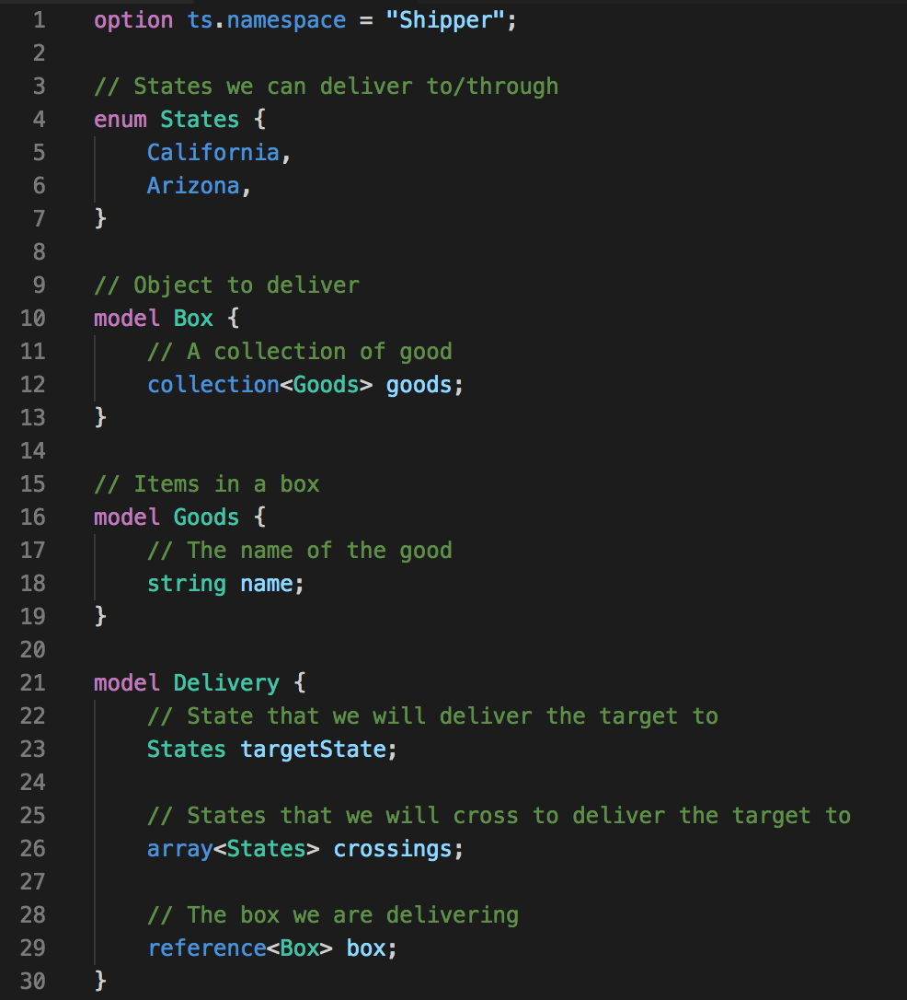

# firemodel Syntax Highlighting

This adds support to VSCode for syntax highlighting of [firemodel](https://github.com/mickeyreiss/firemodel)

## Features

Syntax Highlighting for FireModel!

Will add language support and intellisense at a later date.